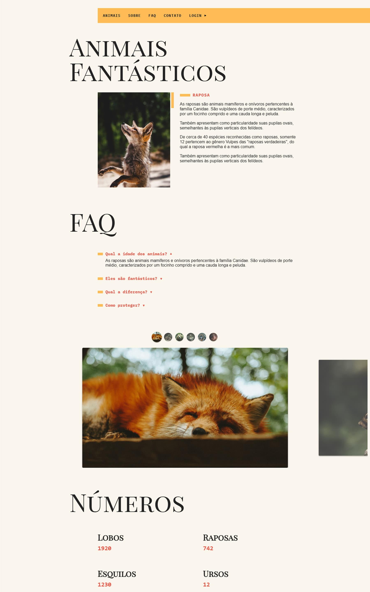
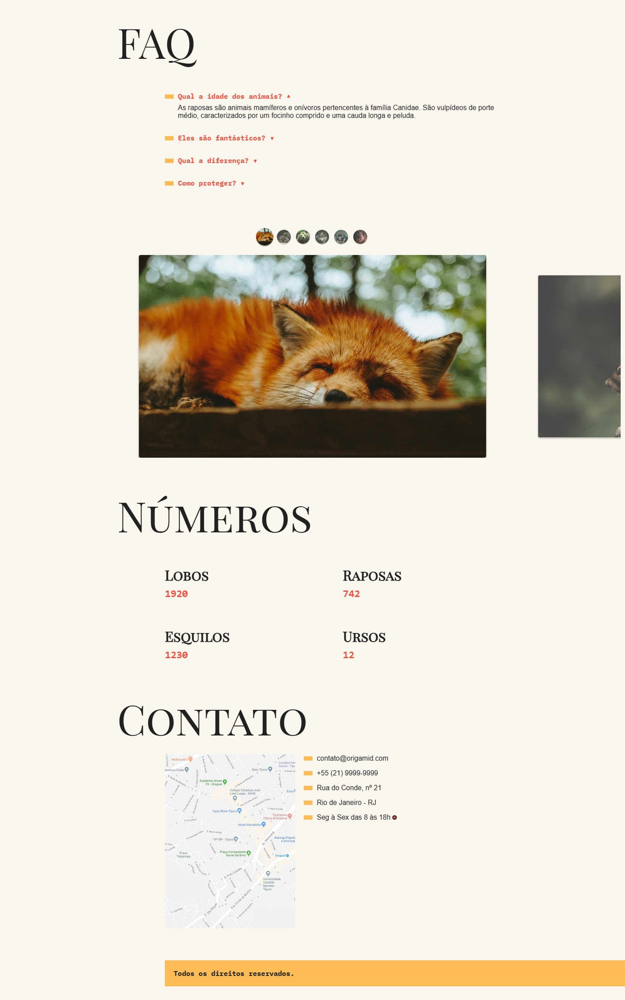
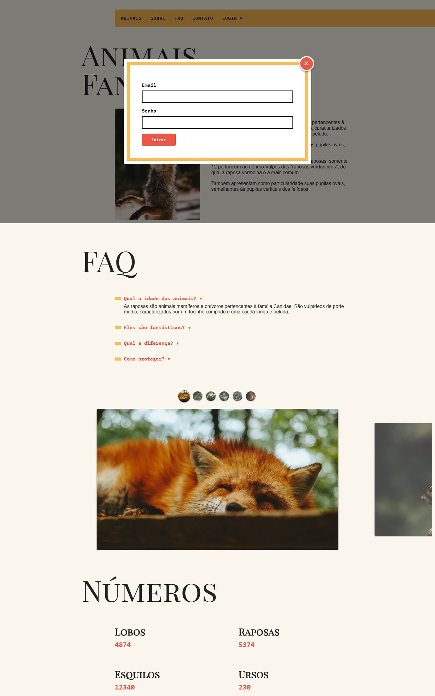

# ORIGAMID - JavaScript Completo ES6

[]()
[]()



> Projeto desenvolvido durante o curso JavaScript Completo ES6 da Origamid

## 🔗 Links

- **Demo ao vivo:** https://github.com/alvarenga-codes/origamid-animais-fantasticos
- **Curso:** [Origamid - JavaScript Completo ES6](https://www.origamid.com)

---

## 📋 Sobre

Projeto completo desenvolvido como exercício final do curso **JavaScript Completo ES6** da [Origamid](https://origamid.com).

O objetivo era praticar e consolidar conhecimentos de Javascript Vanilla, criando um site profissional e responsivo do zero.

---

## 🎯 Objetivos de Aprendizado

- ✅ Dominar HTML, CSS e, principalmente, Javasript
- ✅ Praticar type module, babel, eslint
- ✅ Criar layout responsivo completo
- ✅ Trabalhar com interações Javascript

---

## ✨ Características

### Layout & Design

- Design moderno e profissional
- Layout responsivo (mobile, tablet, desktop)
- Javascript avançado
- Animações e transições suaves
- Tipografia bem trabalhada

### Funcionalidades

- Menu responsivo
- Animações suaves
- Outsideclick
- Tooltip

### Técnicas Aplicadas

- HTML5 semântico
- CSS moderno (variáveis, Flexbox)
- Javascript vanilla
- Acessibilidade (ARIA, semântica)

---

## 🛠️ Tecnologias

- **HTML5** - Estrutura semântica
- **CSS3** - Estilização avançada
- **Javascript** - Interações
- **Git** - Versionamento
- **GitHub Pages** - Deploy

### Conceitos Praticados

- CSS Flexbox/GRID
- Javascript type module
- Responsive Design
- Eslint
- Babel
- Webpack
- Debounce
- Fetch

---

## 📁 Estrutura do Projeto

```
projeto/
├── css/
│   ├── style.css          # Estilos principais
│   └── [modulos].css      # Estilos por módulo
├── img                    # Imagens
├── js                     # Javascript
│   ├── modulos            # Módulos separados por responsabilidades
│   └── script.js          # Estilos por módulo
├── main                   # Codigo js compactado com webpack
├── index.html              # Página principal
└── README.md
```

## 📸 Screenshots

### Home


### Faq



### Modal



---

## 📚 O que Aprendi

Desenvolvendo este projeto, consolidei conhecimentos em:

- **HTML:** Semântica aplicada na prática
- **CSS:** Aplicação de Flexbox
- **JS:** Interações com js, como scrool suave, modal, fetch
- **Babel:** Aplicação atual do babel
- **Eslint:** Boas práticas de código
- **Webpack:** Compactação para melhor performance

---

## 🎓 Certificado

Este projeto faz parte do curso **JavaScript Completo ES6** da Origamid.

[](https://www.origamid.com/certificate/eb3a2290)

---

## 👤 Autor

**Rodrigo Alvarenga**  
_Desenvolvedor Frontend & UI Designer_

[](mailto:alvarenga.frontend@gmail.com)
[](https://github.com/alvarenga-codes)

---

## 📖 Sobre a Origamid

A [Origamid](https://origamid.com) é uma plataforma de cursos online focada em design e desenvolvimento web, reconhecida pela qualidade técnica e didática dos seus conteúdos.

---

<div align="center">

**Se este projeto te ajudou, considere dar uma ⭐**

Desenvolvido durante curso Origamid | 2025

</div>
